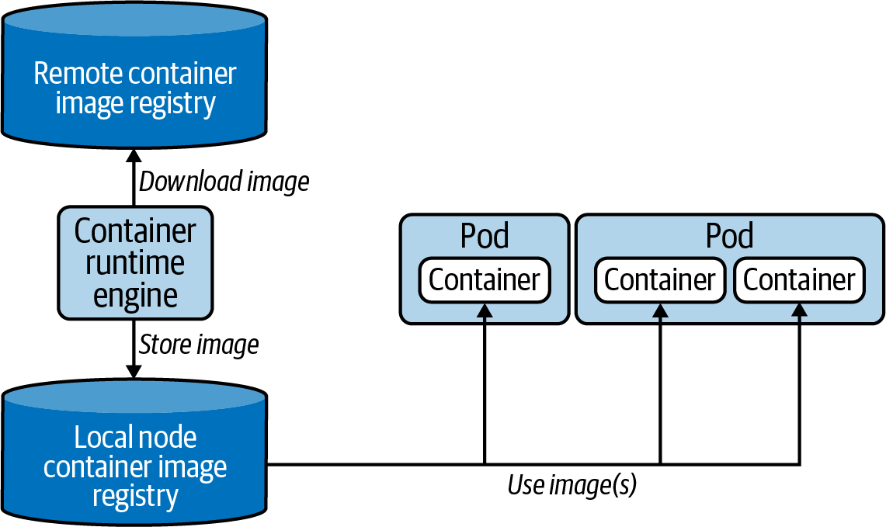

### kubectl pod manipulations 

#### Big picture



src : https://learning.oreilly.com/library/view/certified-kubernetes-application/9781098152857/ch05.html#id134

#### Manipulation 

```shell
kubectl run friends --image=friends-service:0.1.0  --port=8000 --env="DATA=sample" --labels="app=friends-app,env=dev"
# > pod/friends created
# check rancher os desktop cluster dashboard 

# Alternatively use declarative mode
kubectl apply -f .\deployments\friends-pod.yml

# Listing and getting pods 
kubectl get pods
kubectl get pods friends
# > NAME      READY   STATUS    RESTARTS   AGE
# > friends   1/1     Running   0          26m
# Status are : Pending, Running, Succeeded, Failed and Unknown

# Get pods details 
kubectl describe pods friends

# Get pod logs 
kubectl logs friends
kubectl logs friends -f 

# Execute commands on pod 
kubectl exec friends -- cat /app/index.ts
kubectl exec friends -- env | grep ^DATA=
kubectl exec -it friends -- /bin/bash

# Use temporary pod (execute in shell)
$FRIENDS_IP=kubectl describe pods friends | Select-String -Pattern '^IP:\s+(\d{1,3}\.\d{1,3}\.\d{1,3}\.\d{1,3})' | ForEach-Object { $_.Matches.Groups[1].Value }
kubectl run busybox --image=busybox:1.36.1 --env="FRIENDS_HOST=$FRIENDS_IP" --rm -it --restart=Never -- sh -c 'wget -qO- $FRIENDS_HOST:8000'
kubectl run busybox --image=busybox:1.36.1 --env="FRIENDS_HOST=$FRIENDS_IP" --rm -it --restart=Never -- sh -c 'wget -qO- $FRIENDS_HOST:8000/health'
# Delete pod 
kubectl delete pod friends
kubectl delete -f .\deployments\friends-pod.yml
```


#### Dry run

```shell
kubectl run friends --image=friends-service:0.1.0  --port=8000 --env="DATA=sample" --labels="app=friends-app,env=dev"  -o yaml --dry-run=client
# Change command and replace pod 
kubectl run friends --image=friends-service:0.1.0  --port=8000 --env="DATA=sample" --labels="app=friends-app,env=dev"  -o yaml > ./02-pods/deployments/friends-pod-updated.yml --dry-run=client -- sh -c 'deno --version; deno run --allow-net index.ts'
kubectl replace --force=true -f ./deployments/friends-pod-updated.yml
kubectl logs friends
```

#### Pod probs 

```shell
# Readiness probe 
# No traffic accepted until pod container is ready
kubectl create -f ./deployments/friends-pod-ready.yml
kubectl describe pod friends-readiness

kubectl create -f ./deployments/friends-pod-ready-fails.yml
kubectl get pod friends-readiness-fail     
# Note : running but not ready                      
# NAME                     READY   STATUS    RESTARTS   AGE
# friends-readiness-fail   0/1     Running   0          54s

kubectl describe pod friends-readiness-fail
# Events:
#   Type     Reason     Age                 From               Message
#   ----     ------     ----                ----               -------
#   Normal   Scheduled  4m7s                default-scheduler  Successfully assigned default/friends-readiness-fail to hbensassi2-pc
#   Normal   Pulled     4m7s                kubelet            Container image "friends-service:0.1.0" already present on machine
#   Normal   Created    4m7s                kubelet            Created container friends
#   Normal   Started    4m7s                kubelet            Started container friends
#   Warning  Unhealthy  7s (x16 over 4m5s)  kubelet            Readiness probe failed: ...
```

```shell
# Liveness probe 
# Pod restarted if not live
kubectl create -f ./deployments/friends-pod-live.yml
kubectl logs friends-liveness  
# Listening on http://localhost:8000/
# [2024-01-15T19:42:20.056Z] GET http://10.42.0.206:8000/health
# [2024-01-15T19:42:30.056Z] GET http://10.42.0.206:8000/health

kubectl create -f ./deployments/friends-pod-live-fails.yml
kubectl get pod friends-liveness-fail   
# Note : notice the restarts
# NAME                    READY   STATUS    RESTARTS     AGE
# friends-liveness-fail   1/1     Running   2 (5s ago)   65s

```

```shell
# Startup probe 
# all probes wait to startup finish or timeout (if it fails then restart the pod)
kubectl delete -f ./deployments/friends-pod-startup.yml
kubectl create -f ./deployments/friends-pod-startup.yml
kubectl logs -f friends-startup  
# Note first health check after 30 seconds - then readiness probe every 10s
# Listening on http://localhost:8000/
# [2024-01-15T20:00:45.758Z] GET http://10.42.0.226:8000/health
# [2024-01-15T20:00:45.761Z] GET http://10.42.0.226:8000/health
# [2024-01-15T20:00:55.758Z] GET http://10.42.0.226:8000/health
```
