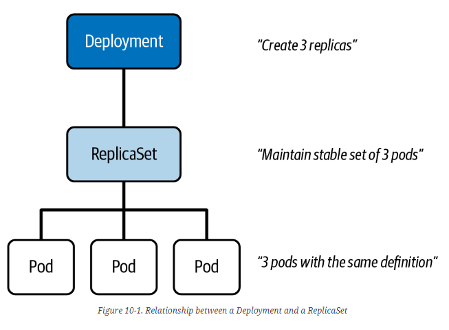
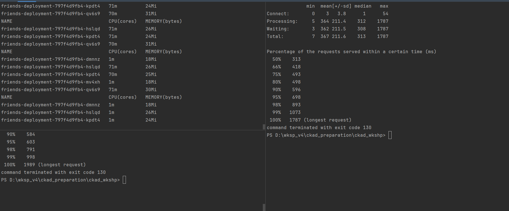

### Deployment and replicaset 



#### Deployment 

```shell
kubectl create -f ./deployment/deployment.yml
kubectl get deployment
# NAME                 READY   UP-TO-DATE   AVAILABLE   AGE
# friends-deployment   4/4     4            4           18s

kubectl get replicasets -o wide -l app=friends-app
# NAME                           DESIRED   CURRENT   READY   AGE     CONTAINERS   IMAGES                  SELECTOR
# friends-deployment-f5bc6f64b   4         4         4       4m10s   friends      friends-service:0.1.0   app=friends-app,pod-template-hash=f5bc6f64b

kubectl describe deployment friends-deployment

kubectl get pods -l app=friends-app
# NAME                                 READY   STATUS    RESTARTS      AGE
# friends-deployment-f5bc6f64b-z2pjg   1/1     Running   0             102s
# friends-deployment-f5bc6f64b-87ngz   1/1     Running   0             102s
# friends-deployment-f5bc6f64b-hp4th   1/1     Running   0             102s
# friends-deployment-f5bc6f64b-dkms7   1/1     Running   0             102s

kubectl delete pod friends-deployment-f5bc6f64b-dkms7
kubectl get deployment friends-deployment
# NAME                 READY   UP-TO-DATE   AVAILABLE   AGE
# friends-deployment   3/4     4            3           6m20s

kubectl get pods -l app=friends-app
# NAME                                 READY   STATUS    RESTARTS      AGE
# friends-deployment-f5bc6f64b-z2pjg   1/1     Running   0             6m21s
# friends-deployment-f5bc6f64b-87ngz   1/1     Running   0             6m21s
# friends-deployment-f5bc6f64b-hp4th   1/1     Running   0             6m21s
# friends-deployment-f5bc6f64b-ss7tx   1/1     Running   0             2s

kubectl delete deployment friends-deployment
kubectl get pods -l app=friends-app
# Empty
```

#### Rollout

```shell
docker build -t friends-service:0.2.0 -f ./docker/friends-2/Dockerfile ./docker/friends-2
kubectl create -f ./deployment/deployment.yml
kubectl set image deployment friends-deployment friends=friends-service:0.2.0
# Note : can use kubectl apply, kubectl replace or kubectl edit

kubectl rollout status deployment friends-deployment
# Waiting for deployment "friends-deployment" rollout to finish: 1 old replicas are pending termination...
# Waiting for deployment "friends-deployment" rollout to finish: 1 old replicas are pending termination...
# Waiting for deployment "friends-deployment" rollout to finish: 1 old replicas are pending termination...
# Waiting for deployment "friends-deployment" rollout to finish: 1 old replicas are pending termination...
# deployment "friends-deployment" successfully rolled out
kubectl get pods -l app=friends-app
$POD_IP=kubectl describe pods friends-deployment-757757f8bf-7vxd8 | Select-String -Pattern '^IP:\s+(\d{1,3}\.\d{1,3}\.\d{1,3}\.\d{1,3})' | ForEach-Object { $_.Matches.Groups[1].Value }
kubectl run busybox --image=busybox:1.36.1 --env="POD_IP=$POD_IP" --rm -it --restart=Never -- sh -c 'wget -qO- $POD_IP:8000'
# {"hostname":"friends-deployment-757757f8bf-7vxd8","apiVersion":"2","quote":{"character":"Joey Tribbiani","quote":"Joey doesn't share food!"}}

kubectl rollout history deployment friends-deployment
# deployment.apps/friends-deployment 
# REVISION  CHANGE-CAUSE
# 1         <none>
# 2         <none>
# Note : 
# By default, a Deployment persists a maximum of 10 revisions in its history. 
# You can change the limit by assigning a different value to spec.revisionHistoryLimit.

kubectl rollout history deployments friends-deployment --revision=2

# Rollout with change cause
docker build -t friends-service:0.3.0 -f ./docker/friends-3/Dockerfile ./docker/friends-3
kubectl apply -f ./deployment/deployment-v3.yml
kubectl rollout history deployment friends-deployment
# REVISION  CHANGE-CAUSE
# 1         <none>
# 2         <none>
# 3         Update to version 0.3.0 of Friends app

# Rollback 
kubectl rollout undo deployment friends-deployment --to-revision=1
kubectl rollout history deployment friends-deployment
# REVISION  CHANGE-CAUSE
# 2         <none>
# 3         Update to version 0.3.0 of Friends app
# 4         <none>

```

#### Scaling Workloads

```shell
# Manual scaling 
kubectl scale deployment friends-deployment --replicas=6
kubectl get pods -l app=friends-app
# NAME                                 READY   STATUS    RESTARTS      AGE
# friends-deployment-f5bc6f64b-kmwlw   1/1     Running   0             114s
# friends-deployment-f5bc6f64b-cwd28   1/1     Running   0             114s
# friends-deployment-f5bc6f64b-4c7zg   1/1     Running   0             112s
# friends-deployment-f5bc6f64b-2r4dg   1/1     Running   0             112s
# friends-deployment-f5bc6f64b-vm5x5   1/1     Running   0             12s
# friends-deployment-f5bc6f64b-bpm6m   1/1     Running   0             12s
```

```shell
# Auto scaling 
kubectl delete -f ./deployment/deployment.yml
kubectl get pods -l app=friends-app
# Empty 

# Horizontal Pod Autoscaler = hpa
kubectl create -f ./deployment/deployment-autoscaler.yml
kubectl get pods -l app=friends-app
# NAME                                  READY   STATUS    RESTARTS   AGE
# friends-deployment-797f4d9fb4-qv6s9   1/1     Running   0          45s
# friends-deployment-797f4d9fb4-hslqd   1/1     Running   0          29s
# friends-deployment-797f4d9fb4-kpdt4   1/1     Running   0          29s
kubectl get hpa friends-deployment-scaler
# NAME                        REFERENCE                       TARGETS                     MINPODS   MAXPODS   REPLICAS   AGE
# friends-deployment-scaler   Deployment/friends-deployment   2%/60%, 18625877333m/70Mi   3         5         3          98s

kubectl describe hpa friends-deployment-scaler

# Get pods IPs
kubectl get pods -l app=friends-app -o json | ConvertFrom-Json | Select-Object -ExpandProperty items | ForEach-Object { Write-Host "Pod: $($_.metadata.name), IP: $($_.status.podIP)" }
# Pod: friends-deployment-797f4d9fb4-qv6s9, IP: 10.42.0.254
# Pod: friends-deployment-797f4d9fb4-hslqd, IP: 10.42.0.3
# Pod: friends-deployment-797f4d9fb4-kpdt4, IP: 10.42.0.2

kubectl create -f ./deployment/load-monitor.yml
# in one cmd
kubectl logs -f monitor-pods

# in other cmds
kubectl exec -it load-test-pod -- sh -c 'ab -n 100000 -c 100 http://10.42.0.254:8000/'
kubectl exec -it load-test-pod -- sh -c 'ab -n 100000 -c 100 http://10.42.0.3:8000/'
kubectl exec -it load-test-pod -- sh -c 'ab -n 100000 -c 100 http://10.42.0.2:8000/'

```




#### Deployment Strategies 
##### RollingUpdate (default): Ramped Deployment Strategy

Zero downtime
Old and new versions of the application run in parallel

```shell
kubectl delete -f ./deployment/deployment-autoscaler.yml
kubectl create -f ./deployment/deployment-rolling-update.yml

# into another terminal
while ($true) { [Console]::Clear(); kubectl get pods -l app=friends-app -o custom-columns=NAME:.metadata.name,STATUS:.status.phase,READY:.status.containerStatuses[0].ready,CREATION:.metadata.creationTimestamp,IMAGE:.spec.containers[0].image; Start-Sleep -Seconds 5 }
# NAME                                          LABELS                                              STATUS    READY   AGE
# friends-deployment-rolling-6457dd594b-sst5q   map[app:friends-app pod-template-hash:6457dd594b]   Running   true    2024-01-15T20:20:59Z
# friends-deployment-rolling-6457dd594b-zfmvk   map[app:friends-app pod-template-hash:6457dd594b]   Running   true    2024-01-15T20:20:59Z
# friends-deployment-rolling-6457dd594b-x5f6r   map[app:friends-app pod-template-hash:6457dd594b]   Running   true    2024-01-15T20:20:59Z
# friends-deployment-rolling-6457dd594b-7lsnw   map[app:friends-app pod-template-hash:6457dd594b]   Running   true    2024-01-15T20:20:59Z

kubectl edit deployment friends-deployment-rolling
# change container image and save
```

##### Recreate : Fixed Deployment Strategy
The fixed deployment strategy will terminate replicas with the old application version at once 
before creating another ReplicaSet that controls replicas running the new application version.

```shell
apiVersion: apps/v1
kind: Deployment
metadata:
  name: friends-deployment-rolling
spec:
  replicas: 4
  strategy:
    type: Recreate 
  selector:
...
```

##### App architecture based Deployment Strategies
Not built-in
Use of many Deployment objects at the same time
Covered in Service chapter : 
* Blue-Green Deployment Strategy
* Canary Deployment Strategy
