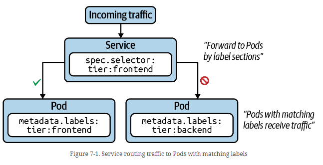
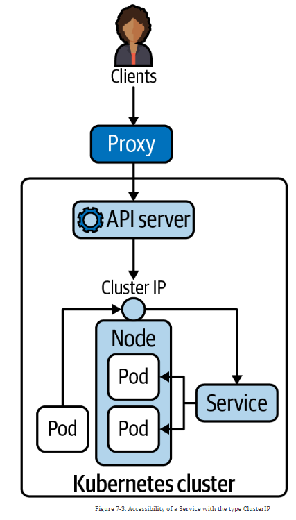
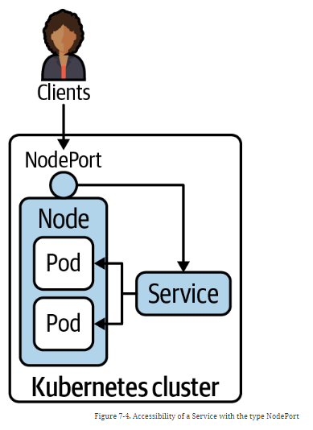

### Services




#### Service declaration and pod selection 

```shell
kubectl create -f ./deployment/services.yml
kubectl get services friends-service
# NAME              TYPE        CLUSTER-IP     EXTERNAL-IP   PORT(S)   AGE
# friends-service   ClusterIP   10.43.219.29   <none>        80/TCP    4m40s

kubectl describe service friends-service

# no more need to container IP
# services are reverse proxies and load balancers
kubectl run busybox --image=busybox:1.36.1 --rm -it --restart=Never -- sh -c 'wget -qO- friends-service:80'
# {"hostname":"friends-single-pod-for-service","apiVersion":"3","quote":{"character":"Ross Geller","quote":"Seven! Seven! Seven!"}}
kubectl run busybox --image=busybox:1.36.1 --rm -it --restart=Never -- sh -c 'wget -qO- friends-service:80'
# Note : notice the hostname change 
# {"hostname":"friends-deployment-for-service-8659d94b84-llxhq","apiVersion":"3","quote":{"character":"Ross Geller","quote":"PIVOT!"}}
# one can use the service cluster IP
kubectl run busybox --image=busybox:1.36.1 --rm -it --restart=Never -- sh -c 'wget -qO- 10.43.219.29:80'
# {"hostname":"friends-deployment-for-service-8659d94b84-mh67x","apiVersion":"3","quote":{"character":"Joey Tribbiani","quote":"How you doin'?"}}

# Kubernetes proxy  (do not use on production)
kubectl proxy --port=9999
# in bash shell 
curl -L localhost:9999/api/v1/namespaces/default/services/friends-service/proxy
# {"hostname":"friends-deployment-for-service-8659d94b84-cglgw","apiVersion":"3","quote":{"character":"Ross Geller","quote":"Seven! Seven! Seven!"}}

# Change service type to node port 
kubectl patch service friends-service -p '{\"spec\": {\"type\": \"NodePort\"}}'
# Note : kubectl patch service friends-service -p '{"spec": {"type": "NodePort"}}' in bash - quoting handling is for powershell
kubectl get service friends-service
# NAME              TYPE       CLUSTER-IP     EXTERNAL-IP   PORT(S)        AGE
# friends-service   NodePort   10.43.219.29   <none>        80:31748/TCP   21m
kubectl get nodes
# NAME      STATUS   ROLES                  AGE    VERSION
# node-pc   Ready    control-plane,master   185d   v1.27.3+k3s1
kubectl describe node node-pc | grep InternalIP:
# InternalIP:  172.20.129.222
curl -L localhost:31748
# {"hostname":"friends-deployment-for-service-8659d94b84-cglgw","apiVersion":"3","quote":{"character":"Ross Geller","quote":"We were on a break!"}}

```
| Service Type | Description                                                                                             |
|--------------|---------------------------------------------------------------------------------------------------------|
| ClusterIP    | Exposes the Service on a cluster-internal IP. Only reachable from within the cluster.                   |
| NodePort     | Exposes the Service on each node’s IP address at a static port. Accessible from outside of the cluster. |
| LoadBalancer | Exposes the Service externally using a cloud provider’s load balancer.                                  |
| ExternalName | Maps a Service to a DNS name.                                                                           |





#### Network Policy 

```shell
# /!\ Note : Rancher Desktop do not have network controller by default 
kubectl delete -f ./deployment/network-policy-no-policy.yml
kubectl create -f ./deployment/network-policy-no-policy.yml

kubectl logs -f -c sidecar np-nginx-backend 
# Wed Jan 17 15:39:05 UTC 2024: Successful HTTP request to np-nginx-frontend-service:80. Status: 200
# Wed Jan 17 15:39:10 UTC 2024: Successful HTTP request to np-nginx-frontend-service:80. Status: 200

kubectl logs -f -c sidecar np-nginx-frontend 
# Wed Jan 17 15:39:15 UTC 2024: Successful HTTP request to np-nginx-backend-service:80. Status: 200
# Wed Jan 17 15:39:20 UTC 2024: Successful HTTP request to np-nginx-backend-service:80. Status: 200

kubectl delete -f ./deployment/np-disallow-all.yml
kubectl create -f ./deployment/np-disallow-all.yml

```

#### Blue-Green Deployment Strategy 

```shell
kubectl create -f ./deployment/green-blue-initial.yml
kubectl get pods -l app=friends-app
# NAME                                       READY   STATUS    RESTARTS   AGE
# friends-blue-deployment-5d64844ff6-j9qrb   1/1     Running   0          52s
# friends-blue-deployment-5d64844ff6-rrtsj   1/1     Running   0          52s
kubectl run busybox --image=busybox:1.36.1 --rm -it --restart=Never -- sh -c 'wget -qO- friends-gb-service:80'
# {"apiVersion":"1","quote":{"character":"Chandler Bing","quote":"I'm not great at the advice. Can I interest you in a sarcastic comment?"}}

kubectl create -f ./deployment/green-blue-rollout.yml
# NAME                                        READY   STATUS    RESTARTS   AGE
# friends-blue-deployment-5d64844ff6-j9qrb    1/1     Running   0          2m40s
# friends-blue-deployment-5d64844ff6-rrtsj    1/1     Running   0          2m40s
# friends-green-deployment-79c8ffd4cc-wffz5   1/1     Running   0          8s
# friends-green-deployment-79c8ffd4cc-qh8t9   1/1     Running   0          8s
kubectl run busybox --image=busybox:1.36.1 --rm -it --restart=Never -- sh -c 'wget -qO- friends-gb-service:80'
# {"apiVersion":"1","quote":{"character":"Chandler Bing","quote":"I'm not great at the advice. Can I interest you in a sarcastic comment?"}}
kubectl describe service friends-gb-service
# Selector: app=friends-app,type=blue
kubectl patch service friends-gb-service  -p '{\"spec\": {\"selector\": {\"app\": \"friends-app\", \"type\": \"green\"}}}'
kubectl describe service friends-gb-service
# Selector: app=friends-app,type=green
kubectl run busybox --image=busybox:1.36.1 --rm -it --restart=Never -- sh -c 'wget -qO- friends-gb-service:80'
# {"hostname":"friends-green-deployment-79c8ffd4cc-wffz5","apiVersion":"3","quote":{"character":"Rachel Green","quote":"I got off the plane."}}
kubectl get pods -l app=friends-app
# 4 pods 
kubectl delete deployment friends-blue-deployment
kubectl get pods -l app=friends-app
# 2 pods 
```

#### Canary Deployment Strategy

```shell
kubectl create -f ./deployment/canary-initial.yml
kubectl get pods -l app=friends-app
# NAME                              READY   STATUS    RESTARTS   AGE
# friends-canary-56b7cdc645-8fj8l   1/1     Running   0          12s
# friends-canary-56b7cdc645-n44nv   1/1     Running   0          12s
# friends-canary-56b7cdc645-2jkn2   1/1     Running   0          12s
# friends-canary-56b7cdc645-9mj6x   1/1     Running   0          12s

kubectl run busybox --image=busybox:1.36.1 --rm -it --restart=Never -- sh -c 'wget -qO- friends-canary-service:80'
# {"apiVersion":"1","quote":{"character":"Chandler Bing","quote":"Could I BE wearing any more clothes?"}}

kubectl create -f ./deployment/canary-new-version.yml
kubectl get pods -l app=friends-app --show-labels
# NAME                                  READY   STATUS    RESTARTS   AGE   LABELS
# friends-canary-56b7cdc645-8f768       1/1     Running   0          36s   app=friends-app,pod-template-hash=56b7cdc645,type=stable
# friends-canary-56b7cdc645-fkb6t       1/1     Running   0          36s   app=friends-app,pod-template-hash=56b7cdc645,type=stable
# friends-canary-56b7cdc645-mclqb       1/1     Running   0          36s   app=friends-app,pod-template-hash=56b7cdc645,type=stable
# friends-canary-56b7cdc645-bpwv6       1/1     Running   0          36s   app=friends-app,pod-template-hash=56b7cdc645,type=stable
# friends-canary-new-7968666574-d8546   1/1     Running   0          7s    app=friends-app,pod-template-hash=7968666574,type=canary

kubectl run busybox --image=busybox:1.36.1 --rm -it --restart=Never -- sh -c 'for i in $(seq 10); do wget -qO- friends-canary-service:80 && echo "\n"; done'
# {"apiVersion":"1","quote":{"character":"Chandler Bing","quote":"I'm hopeless and awkward and desperate for love!"}}n
# {"apiVersion":"1","quote":{"character":"Chandler Bing","quote":"Could I BE wearing any more clothes?"}}n
# {"hostname":"friends-canary-new-7968666574-d8546","apiVersion":"3","quote":{"character":"Phoebe Buffay","quote":"They don't know that we know they know we know."}}n
# {"apiVersion":"1","quote":{"character":"Phoebe Buffay","quote":"I wish I could, but I don't want to."}}n
# ...

# NOTE : use service meshing like Istio to better traffic control

```
